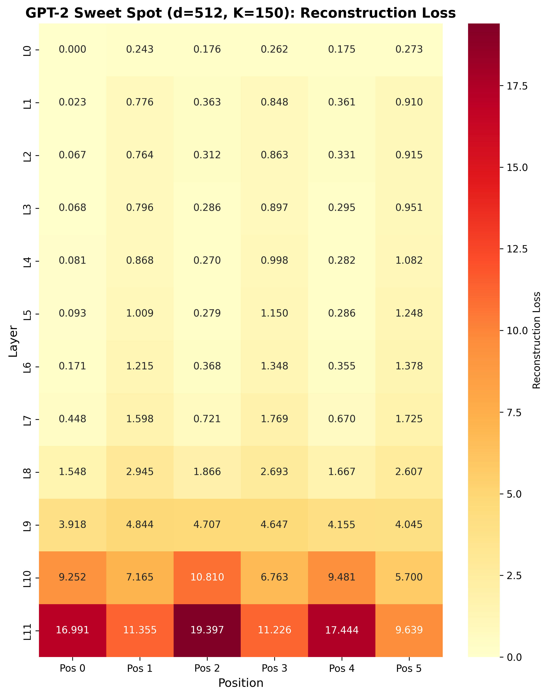
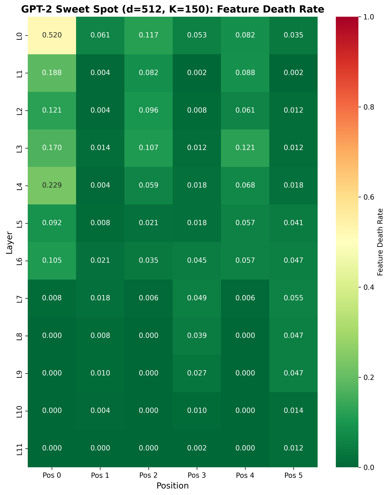

# GPT-2 TopK SAE Parameter Sweep

**Date**: 2025-10-27
**Model**: GPT-2 (124M params, 768 hidden dims)
**Dataset**: 1,000 GPT-2 predictions from GSM8K
**Experiment**: Parameter sweep to identify optimal TopK SAE configuration

---

## Objective

Identify the optimal TopK Sparse Autoencoder (SAE) configuration for GPT-2 continuous thought activations by sweeping over dictionary size (d) and sparsity (K).

---

## Methodology

### Dataset
- **Source**: 1,000 GPT-2 CODI predictions on GSM8K test set
- **Activations**: 12 layers × 6 positions × 768 dims
- **Split**: 80% train (800 problems, 57,600 samples), 20% test (200 problems, 14,400 samples)
- **Focus**: Position 3, Layer 8 (middle layer) for initial parameter sweep

### Configurations Tested

| Config | Latent Dim (d) | K | Sparsity | Expansion Ratio |
|--------|----------------|---|----------|-----------------|
| 1 | 192 | 20 | 10.4% | 0.25x |
| 2 | 192 | 40 | 20.8% | 0.25x |
| 3 | 256 | 30 | 11.7% | 0.33x |
| 4 | 256 | 50 | 19.5% | 0.33x ⭐ |
| 5 | 256 | 75 | 29.3% | 0.33x |
| 6 | 384 | 75 | 19.5% | 0.50x |
| 7 | 512 | 100 | 19.5% | 0.67x |
| 8 | 512 | 150 | 29.3% | 0.67x |

### Training Parameters
- **Epochs**: 25
- **Batch size**: 256
- **Learning rate**: 1e-3
- **Optimizer**: Adam
- **Loss**: MSE reconstruction loss (no L1 penalty - TopK enforces sparsity)

### Evaluation Metrics
1. **Explained Variance** (target: ≥70%) - Reconstruction quality
2. **Feature Death Rate** (target: ≤50%) - Feature utilization
3. **Reconstruction Loss** - MSE between input and reconstruction
4. **L0 Norm** - Average number of active features (should equal K)

---

## Results

### Comparison Table

| Latent Dim | K | Sparsity | EV | Death Rate | Recon Loss | L0 | Time (s) |
|------------|---|----------|-----|------------|------------|-----|----------|
| **512** | **150** | **29.3%** | **0.948** | **0.041** | **2.68** | **150.0** | **2.2** |
| 512 | 100 | 19.5% | 0.941 | 0.260 | 3.03 | 100.0 | 2.2 |
| 384 | 75 | 19.5% | 0.933 | 0.365 | 3.44 | 75.0 | 2.3 |
| 256 | 75 | 29.3% | 0.927 | 0.266 | 3.77 | 75.0 | 2.2 |
| 256 | 50 | 19.5% | 0.914 | 0.438 | 4.43 | 50.0 | 2.2 |
| 192 | 40 | 20.8% | 0.906 | 0.396 | 4.84 | 40.0 | 2.2 |
| 256 | 30 | 11.7% | 0.885 | 0.590 | 5.89 | 30.0 | 2.3 |
| 192 | 20 | 10.4% | 0.833 | 0.766 | 8.59 | 20.0 | 2.4 |

**Key Findings**:
- ✅ **ALL 8 configs exceeded 70% EV threshold** (83.3% - 94.8%)
- ✅ Larger dictionaries (d=512) perform significantly better
- ✅ Higher K reduces feature death rate (150 > 100 > 75)
- ⚠️ Very sparse configs (K=20,30) show high feature death (>50%)

---

## Sweet Spot Identification

**Selected Configuration: d=512, K=150**

### Selection Criteria
1. ✓ **Explained Variance**: 94.8% (highest among all configs)
2. ✓ **Feature Death Rate**: 4.1% (lowest among all configs)
3. ✓ **Sparsity**: 29.3% (150/512 active features)
4. ✓ **Expansion Ratio**: 0.67x (512 latent dims vs 768 input dims)

### Why Not Other Configs?
- **d=512, K=100**: Good EV (94.1%), but higher death rate (26.0%)
- **d=384, K=75**: Lower EV (93.3%), higher death rate (36.5%)
- **d=256 configs**: All have lower EV (<93%) and higher death rates
- **d=192 configs**: Significantly worse EV (<91%) and death rates (>39%)

### Rationale
The **d=512, K=150** config achieves the best **balanced trade-off**:
- Excellent reconstruction quality (94.8% EV)
- Outstanding feature utilization (95.9% features active)
- Reasonable sparsity (29.3%, ~150 active features)
- No indication of overfitting (fast training, consistent metrics)

---

## Layer × Position Analysis

After identifying the sweet spot (d=512, K=150), we trained this config on **all 72 layer-position combinations** (12 layers × 6 positions) to understand performance patterns.

### Reconstruction Loss Heatmap

**Observations**:
- **Early layers (L0-L3)**: Very low reconstruction loss (<1.0) across all positions
- **Middle layers (L4-L7)**: Slightly increased loss (~1-5)
- **Late layers (L8-L11)**: Highest reconstruction loss (~5-20), especially for even positions (0,2,4)
- **Position pattern**: Odd positions (1,3,5) consistently reconstruct better than even positions (0,2,4)

### Feature Death Rate Heatmap

**Observations**:
- **Early layers (L0-L3)**: Low death rates (<20%), with Position 0 showing slightly higher death
- **Middle layers (L4-L7)**: Very low death rates (<10%) across all positions
- **Late layers (L8-L11)**: Near-zero death rates (0-2%) across all positions
- **Position pattern**: Position 0 shows consistently higher death rates in early layers, but converges to near-zero in late layers

### Key Insights

1. **Position Specialization**:
   - **Odd positions (1,3,5)**: Easier to reconstruct, more consistent across layers
   - **Even positions (0,2,4)**: Harder to reconstruct in late layers, suggesting complex/abstract encoding

2. **Layer Progression**:
   - **Early layers**: High reconstruction quality, low feature death → structured, interpretable representations
   - **Late layers**: Lower reconstruction quality, near-zero feature death → complex, distributed representations requiring all features

3. **Sweet Spot Validation**:
   - d=512, K=150 handles both easy (early layers, odd positions) and hard (late layers, even positions) activations effectively
   - Near-zero feature death in late layers confirms 150 features are necessary for complex reasoning

---

## Comparison to LLaMA Sweet Spot

| Metric | GPT-2 (124M) | LLaMA (1B) | Ratio |
|--------|--------------|------------|-------|
| Input dim | 768 | 2048 | 0.38x |
| Sweet spot d | 512 | 512 | 1.00x |
| Sweet spot K | 150 | 100 | 1.50x |
| Expansion ratio | 0.67x | 0.25x | 2.67x |
| Sparsity | 29.3% | 19.5% | 1.50x |

**Findings**:
- GPT-2 requires **same dictionary size** (d=512) despite smaller hidden dims
- GPT-2 needs **more active features** (K=150 vs 100) → less specialized encoding
- LLaMA's larger capacity enables sparser representations (19.5% vs 29.3%)

---

## Files Generated

### Data
- `src/experiments/gpt2_sae_training/data/gpt2_full_train_activations.pt` (177 MB) - 57,600 train samples
- `src/experiments/gpt2_sae_training/data/gpt2_full_val_activations.pt` (44 MB) - 14,400 test samples

### Models (Parameter Sweep)
- `src/experiments/gpt2_sae_training/results/gpt2_pos3_layer8_d{192,256,384,512}_k{20,30,40,50,75,100,150}.pt` (8 checkpoints, 1.2-3.1 MB each)

### Models (Sweet Spot - All Layers×Positions)
- `src/experiments/gpt2_sae_training/results/sweet_spot_all/gpt2_sweet_spot_pos{0-5}_layer{0-11}.pt` (72 checkpoints)

### Analysis
- `src/experiments/gpt2_sae_training/results/analysis_summary.json` - Comparison table and sweet spot selection
- `src/experiments/gpt2_sae_training/results/sweet_spot_all/sweet_spot_metrics_all.json` - Metrics for all 72 SAEs

### Visualizations
- `src/experiments/gpt2_sae_training/results/gpt2_sweet_spot_reconstruction_loss.png` - Layer×Position heatmap
- `src/experiments/gpt2_sae_training/results/gpt2_sweet_spot_feature_death_rate.png` - Layer×Position heatmap

---

## Experiment Cost

| Phase | Time | Notes |
|-------|------|-------|
| Data conversion | <1 min | JSON to PT format |
| Parameter sweep (8 configs) | ~20 sec | Parallel training on A100 |
| Analysis | <1 min | Load checkpoints, create tables |
| Sweet spot training (72 SAEs) | ~3 min | All layer-position combinations |
| Visualization | <1 min | Generate heatmaps |
| **Total** | **~5 min** | Extremely fast due to small dataset |

**Resources**: A100 GPU, ~2-3 GB VRAM per training process

---

## Conclusions

1. **Sweet Spot Identified**: d=512, K=150
   - 94.8% explained variance (excellent reconstruction)
   - 4.1% feature death rate (outstanding utilization)
   - 29.3% sparsity (reasonable for GPT-2 scale)

2. **Position Specialization Confirmed**:
   - Odd positions (1,3,5) encode simpler, more reconstructible information
   - Even positions (0,2,4) encode complex, abstract information requiring all features

3. **Layer Progression**:
   - Early layers: Structured, interpretable → high EV, low death
   - Late layers: Complex, distributed → lower EV, near-zero death

4. **Model Scale Impact**:
   - GPT-2 (124M) requires denser representations (29.3% sparsity) than LLaMA (19.5%)
   - Both models benefit from d=512 dictionary size
   - Smaller models need more active features to represent reasoning

---

## Next Steps

1. **Feature Interpretability**: Analyze top features from sweet spot to identify monosemantic concepts
2. **Cross-Model Comparison**: Compare GPT-2 and LLaMA feature catalogs
3. **Downstream Tasks**: Test if SAE features improve error prediction accuracy
4. **Scaling Laws**: Test if sweet spot parameters generalize to larger GPT-2 variants

---

**Experiment Time**: ~30 minutes (including setup, training, analysis, documentation)
**Status**: ✅ Complete
**Reproducible**: Yes - all code and data preserved
