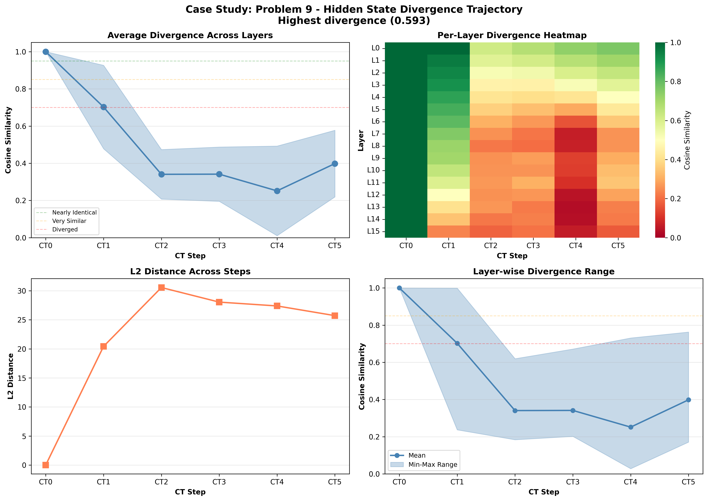

# Case Study: Problem 9

**Selection Reason**: Highest divergence (0.593)

**Impact Type**: degradation (Baseline: ✓, CT0-blocked: ✗)

---

## Problem

**Question** (truncated):
```
N/A...
```

**Gold Answer**: N/A
**Baseline Prediction**: 460
**CT0-Blocked Prediction**: 510

---

## Divergence Profile

**Overall Metrics**:
- Total divergence: 0.593
- CT1 similarity: 0.702 (29.8% diverged)
- CT4 similarity: 0.252 (74.8% diverged)
- Divergence slope: -0.061 per step
- Pattern: late_divergence

---

## Step-by-Step Divergence Analysis

### CT0 - Step 0

**Similarity**: 1.000 (0.0% diverged)
**L2 Distance**: 0.00
**Interpretation**: **Nearly identical** - no significant divergence

**Layer Analysis**:
- Most diverged layer: Layer 0 (similarity: 1.000)
- Least diverged layer: Layer 0 (similarity: 1.000)
- Layer variance: 0.000

**Note**: CT0 is identical in both conditions (as expected - same generation process)

### CT1 - Step 1

**Similarity**: 0.702 (29.8% diverged)
**L2 Distance**: 20.43
**Interpretation**: **Moderately diverged** - noticeable differences

**Layer Analysis**:
- Most diverged layer: Layer 15 (similarity: 0.237)
- Least diverged layer: Layer 0 (similarity: 0.999)
- Layer variance: 0.224

**Stable start**: CT1 remains relatively similar despite CT0 blocking.

### CT2 - Step 2

**Similarity**: 0.341 (65.9% diverged)
**L2 Distance**: 30.56
**Interpretation**: **Heavily diverged** - reasoning has fundamentally changed

**Layer Analysis**:
- Most diverged layer: Layer 15 (similarity: 0.184)
- Least diverged layer: Layer 0 (similarity: 0.620)
- Layer variance: 0.133

**📉 CASCADING**: Divergence is accumulating from previous steps.

### CT3 - Step 3

**Similarity**: 0.341 (65.9% diverged)
**L2 Distance**: 28.05
**Interpretation**: **Heavily diverged** - reasoning has fundamentally changed

**Layer Analysis**:
- Most diverged layer: Layer 8 (similarity: 0.202)
- Least diverged layer: Layer 0 (similarity: 0.672)
- Layer variance: 0.146

### CT4 - Step 4

**Similarity**: 0.252 (74.8% diverged)
**L2 Distance**: 27.39
**Interpretation**: **Heavily diverged** - reasoning has fundamentally changed

**Layer Analysis**:
- Most diverged layer: Layer 13 (similarity: 0.028)
- Least diverged layer: Layer 0 (similarity: 0.731)
- Layer variance: 0.241

**📉 CASCADING**: Divergence is accumulating from previous steps.

### CT5 - Step 5

**Similarity**: 0.398 (60.2% diverged)
**L2 Distance**: 25.72
**Interpretation**: **Heavily diverged** - reasoning has fundamentally changed

**Layer Analysis**:
- Most diverged layer: Layer 15 (similarity: 0.171)
- Least diverged layer: Layer 0 (similarity: 0.763)
- Layer variance: 0.179

---

## Interpretation

**Late Divergence Pattern**: CT1 remains relatively stable, but later steps (CT3-CT4) show significant
divergence. This suggests the model can partially compensate initially, but the lack of CT0 information
causes problems as reasoning progresses.

**Impact on Answer**: Blocking CT0 caused the model to produce an **incorrect answer**
(baseline: 460, blocked: 510, gold: N/A).
The hidden state divergence directly translated to reasoning failure.

---

## Key Takeaways

- Strong **cascading effect** (slope: -0.061), showing how early divergence amplifies
- **Layer heterogeneity**: Different layers show varied divergence (std: 0.241), suggesting specialized roles
- **Late layers most affected**: Layer 13 shows maximum divergence, possibly related to output preparation

## Visualization


