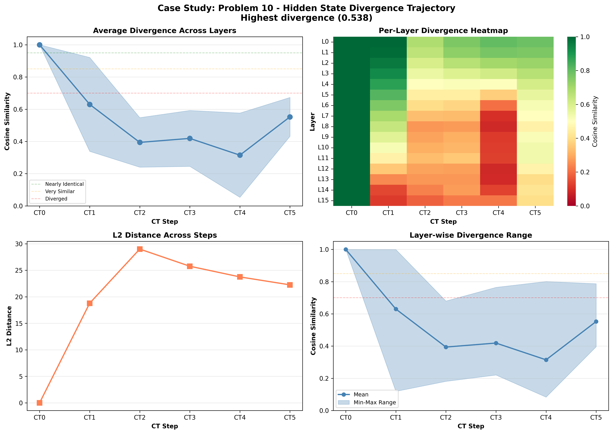

# Case Study: Problem 10

**Selection Reason**: Highest divergence (0.538)

**Impact Type**: no_change (Baseline: ✗, CT0-blocked: ✗)

---

## Problem

**Question** (truncated):
```
N/A...
```

**Gold Answer**: N/A
**Baseline Prediction**: 356
**CT0-Blocked Prediction**: 300

---

## Divergence Profile

**Overall Metrics**:
- Total divergence: 0.538
- CT1 similarity: 0.630 (37.0% diverged)
- CT4 similarity: 0.315 (68.5% diverged)
- Divergence slope: -0.015 per step
- Pattern: late_divergence

---

## Step-by-Step Divergence Analysis

### CT0 - Step 0

**Similarity**: 1.000 (0.0% diverged)
**L2 Distance**: 0.00
**Interpretation**: **Nearly identical** - no significant divergence

**Layer Analysis**:
- Most diverged layer: Layer 0 (similarity: 1.000)
- Least diverged layer: Layer 0 (similarity: 1.000)
- Layer variance: 0.000

**Note**: CT0 is identical in both conditions (as expected - same generation process)

### CT1 - Step 1

**Similarity**: 0.630 (37.0% diverged)
**L2 Distance**: 18.79
**Interpretation**: **Significantly diverged** - major differences

**Layer Analysis**:
- Most diverged layer: Layer 15 (similarity: 0.119)
- Least diverged layer: Layer 0 (similarity: 0.999)
- Layer variance: 0.291

**⚠️ IMMEDIATE DIVERGENCE**: CT1 shows significant divergence from the first step!

### CT2 - Step 2

**Similarity**: 0.394 (60.6% diverged)
**L2 Distance**: 29.00
**Interpretation**: **Heavily diverged** - reasoning has fundamentally changed

**Layer Analysis**:
- Most diverged layer: Layer 15 (similarity: 0.181)
- Least diverged layer: Layer 0 (similarity: 0.680)
- Layer variance: 0.154

**📉 CASCADING**: Divergence is accumulating from previous steps.

### CT3 - Step 3

**Similarity**: 0.419 (58.1% diverged)
**L2 Distance**: 25.76
**Interpretation**: **Heavily diverged** - reasoning has fundamentally changed

**Layer Analysis**:
- Most diverged layer: Layer 15 (similarity: 0.221)
- Least diverged layer: Layer 0 (similarity: 0.765)
- Layer variance: 0.174

### CT4 - Step 4

**Similarity**: 0.315 (68.5% diverged)
**L2 Distance**: 23.75
**Interpretation**: **Heavily diverged** - reasoning has fundamentally changed

**Layer Analysis**:
- Most diverged layer: Layer 8 (similarity: 0.083)
- Least diverged layer: Layer 0 (similarity: 0.801)
- Layer variance: 0.262

**📉 CASCADING**: Divergence is accumulating from previous steps.

### CT5 - Step 5

**Similarity**: 0.553 (44.7% diverged)
**L2 Distance**: 22.25
**Interpretation**: **Significantly diverged** - major differences

**Layer Analysis**:
- Most diverged layer: Layer 13 (similarity: 0.396)
- Least diverged layer: Layer 0 (similarity: 0.787)
- Layer variance: 0.121

---

## Interpretation

**Late Divergence Pattern**: CT1 remains relatively stable, but later steps (CT3-CT4) show significant
divergence. This suggests the model can partially compensate initially, but the lack of CT0 information
causes problems as reasoning progresses.

**Robustness**: Despite significant hidden state divergence, the model **still produced the correct answer**
in both conditions (answer: 356). This suggests redundancy in the reasoning process
or that the specific diverged representations didn't affect the critical computation for this problem.

---

## Key Takeaways

- CT1 diverges **immediately** (< 65% similarity), confirming CT0's critical role from the first reasoning step
- **Resilient reasoning**: High divergence but correct answer demonstrates model robustness
- **Layer heterogeneity**: Different layers show varied divergence (std: 0.262), suggesting specialized roles

## Visualization


