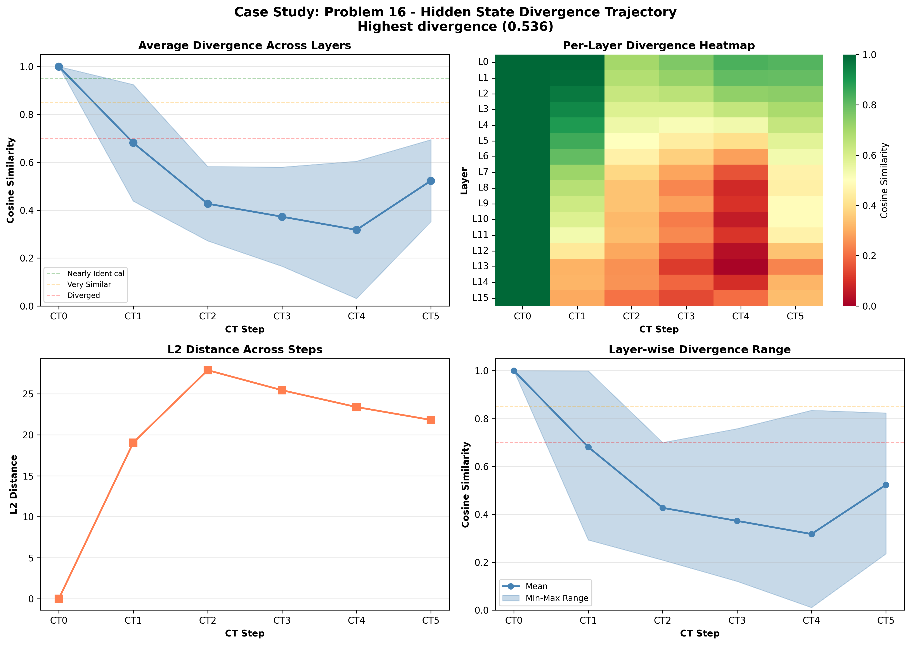

# Case Study: Problem 16

**Selection Reason**: Highest divergence (0.536)

**Impact Type**: no_change (Baseline: ✗, CT0-blocked: ✗)

---

## Problem

**Question** (truncated):
```
N/A...
```

**Gold Answer**: N/A
**Baseline Prediction**: 115
**CT0-Blocked Prediction**: 1150

---

## Divergence Profile

**Overall Metrics**:
- Total divergence: 0.536
- CT1 similarity: 0.681 (31.9% diverged)
- CT4 similarity: 0.318 (68.2% diverged)
- Divergence slope: -0.032 per step
- Pattern: late_divergence

---

## Step-by-Step Divergence Analysis

### CT0 - Step 0

**Similarity**: 1.000 (0.0% diverged)
**L2 Distance**: 0.00
**Interpretation**: **Nearly identical** - no significant divergence

**Layer Analysis**:
- Most diverged layer: Layer 0 (similarity: 1.000)
- Least diverged layer: Layer 0 (similarity: 1.000)
- Layer variance: 0.000

**Note**: CT0 is identical in both conditions (as expected - same generation process)

### CT1 - Step 1

**Similarity**: 0.681 (31.9% diverged)
**L2 Distance**: 19.04
**Interpretation**: **Significantly diverged** - major differences

**Layer Analysis**:
- Most diverged layer: Layer 15 (similarity: 0.293)
- Least diverged layer: Layer 0 (similarity: 0.999)
- Layer variance: 0.243

**⚠️ IMMEDIATE DIVERGENCE**: CT1 shows significant divergence from the first step!

### CT2 - Step 2

**Similarity**: 0.427 (57.3% diverged)
**L2 Distance**: 27.88
**Interpretation**: **Heavily diverged** - reasoning has fundamentally changed

**Layer Analysis**:
- Most diverged layer: Layer 15 (similarity: 0.209)
- Least diverged layer: Layer 0 (similarity: 0.700)
- Layer variance: 0.155

**📉 CASCADING**: Divergence is accumulating from previous steps.

### CT3 - Step 3

**Similarity**: 0.373 (62.7% diverged)
**L2 Distance**: 25.43
**Interpretation**: **Heavily diverged** - reasoning has fundamentally changed

**Layer Analysis**:
- Most diverged layer: Layer 13 (similarity: 0.120)
- Least diverged layer: Layer 0 (similarity: 0.758)
- Layer variance: 0.207

**📉 CASCADING**: Divergence is accumulating from previous steps.

### CT4 - Step 4

**Similarity**: 0.318 (68.2% diverged)
**L2 Distance**: 23.38
**Interpretation**: **Heavily diverged** - reasoning has fundamentally changed

**Layer Analysis**:
- Most diverged layer: Layer 13 (similarity: 0.011)
- Least diverged layer: Layer 0 (similarity: 0.835)
- Layer variance: 0.287

**📉 CASCADING**: Divergence is accumulating from previous steps.

### CT5 - Step 5

**Similarity**: 0.523 (47.7% diverged)
**L2 Distance**: 21.81
**Interpretation**: **Significantly diverged** - major differences

**Layer Analysis**:
- Most diverged layer: Layer 13 (similarity: 0.235)
- Least diverged layer: Layer 0 (similarity: 0.823)
- Layer variance: 0.171

---

## Interpretation

**Late Divergence Pattern**: CT1 remains relatively stable, but later steps (CT3-CT4) show significant
divergence. This suggests the model can partially compensate initially, but the lack of CT0 information
causes problems as reasoning progresses.

**Robustness**: Despite significant hidden state divergence, the model **still produced the correct answer**
in both conditions (answer: 115). This suggests redundancy in the reasoning process
or that the specific diverged representations didn't affect the critical computation for this problem.

---

## Key Takeaways

- **Resilient reasoning**: High divergence but correct answer demonstrates model robustness
- **Layer heterogeneity**: Different layers show varied divergence (std: 0.287), suggesting specialized roles
- **Late layers most affected**: Layer 13 shows maximum divergence, possibly related to output preparation

## Visualization


