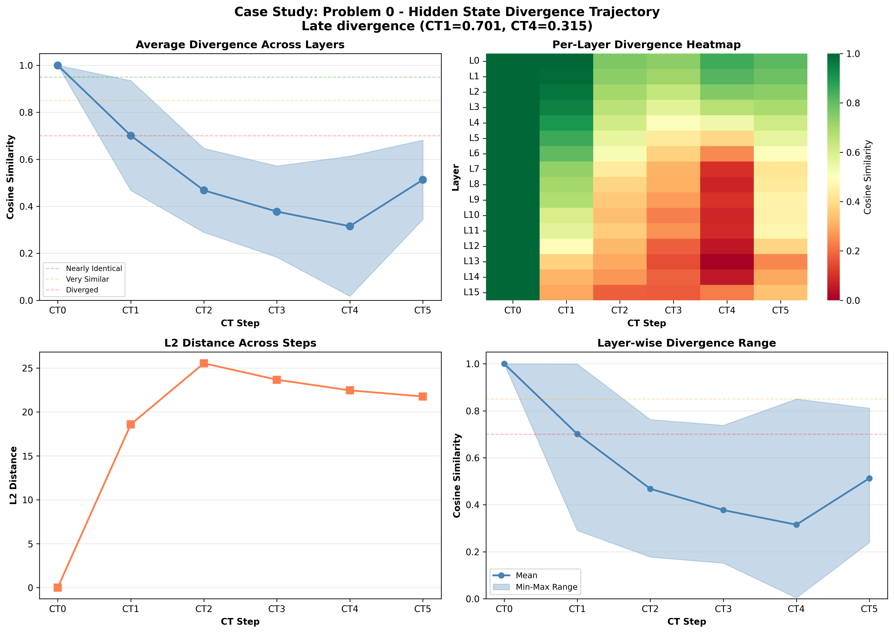

# Case Study: Problem 0

**Selection Reason**: Late divergence (CT1=0.701, CT4=0.315)

**Impact Type**: no_change (Baseline: ✓, CT0-blocked: ✓)

---

## Problem

**Question** (truncated):
```
N/A...
```

**Gold Answer**: N/A
**Baseline Prediction**: 18
**CT0-Blocked Prediction**: 18

---

## Divergence Profile

**Overall Metrics**:
- Total divergence: 0.525
- CT1 similarity: 0.701 (29.9% diverged)
- CT4 similarity: 0.315 (68.5% diverged)
- Divergence slope: -0.038 per step
- Pattern: late_divergence

---

## Step-by-Step Divergence Analysis

### CT0 - Step 0

**Similarity**: 1.000 (0.0% diverged)
**L2 Distance**: 0.00
**Interpretation**: **Nearly identical** - no significant divergence

**Layer Analysis**:
- Most diverged layer: Layer 0 (similarity: 1.000)
- Least diverged layer: Layer 0 (similarity: 1.000)
- Layer variance: 0.000

**Note**: CT0 is identical in both conditions (as expected - same generation process)

### CT1 - Step 1

**Similarity**: 0.701 (29.9% diverged)
**L2 Distance**: 18.58
**Interpretation**: **Moderately diverged** - noticeable differences

**Layer Analysis**:
- Most diverged layer: Layer 15 (similarity: 0.291)
- Least diverged layer: Layer 0 (similarity: 0.999)
- Layer variance: 0.234

**Stable start**: CT1 remains relatively similar despite CT0 blocking.

### CT2 - Step 2

**Similarity**: 0.468 (53.2% diverged)
**L2 Distance**: 25.54
**Interpretation**: **Heavily diverged** - reasoning has fundamentally changed

**Layer Analysis**:
- Most diverged layer: Layer 15 (similarity: 0.178)
- Least diverged layer: Layer 0 (similarity: 0.762)
- Layer variance: 0.179

**📉 CASCADING**: Divergence is accumulating from previous steps.

### CT3 - Step 3

**Similarity**: 0.377 (62.3% diverged)
**L2 Distance**: 23.67
**Interpretation**: **Heavily diverged** - reasoning has fundamentally changed

**Layer Analysis**:
- Most diverged layer: Layer 13 (similarity: 0.152)
- Least diverged layer: Layer 0 (similarity: 0.738)
- Layer variance: 0.194

**📉 CASCADING**: Divergence is accumulating from previous steps.

### CT4 - Step 4

**Similarity**: 0.315 (68.5% diverged)
**L2 Distance**: 22.46
**Interpretation**: **Heavily diverged** - reasoning has fundamentally changed

**Layer Analysis**:
- Most diverged layer: Layer 13 (similarity: 0.004)
- Least diverged layer: Layer 0 (similarity: 0.850)
- Layer variance: 0.298

**📉 CASCADING**: Divergence is accumulating from previous steps.

### CT5 - Step 5

**Similarity**: 0.513 (48.7% diverged)
**L2 Distance**: 21.76
**Interpretation**: **Significantly diverged** - major differences

**Layer Analysis**:
- Most diverged layer: Layer 13 (similarity: 0.240)
- Least diverged layer: Layer 0 (similarity: 0.811)
- Layer variance: 0.169

---

## Interpretation

**Late Divergence Pattern**: CT1 remains relatively stable, but later steps (CT3-CT4) show significant
divergence. This suggests the model can partially compensate initially, but the lack of CT0 information
causes problems as reasoning progresses.

**Robustness**: Despite significant hidden state divergence, the model **still produced the correct answer**
in both conditions (answer: 18). This suggests redundancy in the reasoning process
or that the specific diverged representations didn't affect the critical computation for this problem.

---

## Key Takeaways

- **Resilient reasoning**: High divergence but correct answer demonstrates model robustness
- **Layer heterogeneity**: Different layers show varied divergence (std: 0.298), suggesting specialized roles
- **Late layers most affected**: Layer 13 shows maximum divergence, possibly related to output preparation

## Visualization


