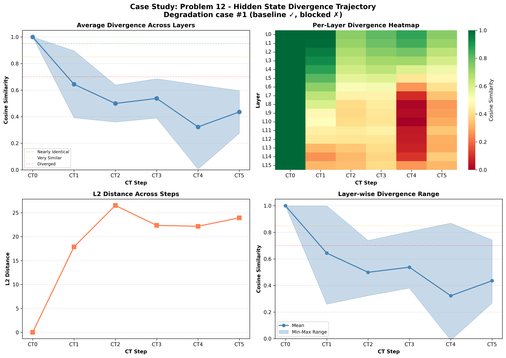

# Case Study: Problem 12

**Selection Reason**: Degradation case #1 (baseline ✓, blocked ✗)

**Impact Type**: degradation (Baseline: ✓, CT0-blocked: ✗)

---

## Problem

**Question** (truncated):
```
N/A...
```

**Gold Answer**: N/A
**Baseline Prediction**: 13
**CT0-Blocked Prediction**: 5

---

## Divergence Profile

**Overall Metrics**:
- Total divergence: 0.512
- CT1 similarity: 0.644 (35.6% diverged)
- CT4 similarity: 0.323 (67.7% diverged)
- Divergence slope: -0.042 per step
- Pattern: late_divergence

---

## Step-by-Step Divergence Analysis

### CT0 - Step 0

**Similarity**: 1.000 (0.0% diverged)
**L2 Distance**: 0.00
**Interpretation**: **Nearly identical** - no significant divergence

**Layer Analysis**:
- Most diverged layer: Layer 0 (similarity: 1.000)
- Least diverged layer: Layer 0 (similarity: 1.000)
- Layer variance: 0.000

**Note**: CT0 is identical in both conditions (as expected - same generation process)

### CT1 - Step 1

**Similarity**: 0.644 (35.6% diverged)
**L2 Distance**: 17.87
**Interpretation**: **Significantly diverged** - major differences

**Layer Analysis**:
- Most diverged layer: Layer 14 (similarity: 0.260)
- Least diverged layer: Layer 0 (similarity: 0.999)
- Layer variance: 0.252

**⚠️ IMMEDIATE DIVERGENCE**: CT1 shows significant divergence from the first step!

### CT2 - Step 2

**Similarity**: 0.499 (50.1% diverged)
**L2 Distance**: 26.53
**Interpretation**: **Heavily diverged** - reasoning has fundamentally changed

**Layer Analysis**:
- Most diverged layer: Layer 14 (similarity: 0.324)
- Least diverged layer: Layer 0 (similarity: 0.739)
- Layer variance: 0.139

**📉 CASCADING**: Divergence is accumulating from previous steps.

### CT3 - Step 3

**Similarity**: 0.537 (46.3% diverged)
**L2 Distance**: 22.36
**Interpretation**: **Significantly diverged** - major differences

**Layer Analysis**:
- Most diverged layer: Layer 14 (similarity: 0.380)
- Least diverged layer: Layer 0 (similarity: 0.805)
- Layer variance: 0.148

### CT4 - Step 4

**Similarity**: 0.323 (67.7% diverged)
**L2 Distance**: 22.18
**Interpretation**: **Heavily diverged** - reasoning has fundamentally changed

**Layer Analysis**:
- Most diverged layer: Layer 10 (similarity: -0.012)
- Least diverged layer: Layer 0 (similarity: 0.869)
- Layer variance: 0.317

**📉 CASCADING**: Divergence is accumulating from previous steps.

### CT5 - Step 5

**Similarity**: 0.436 (56.4% diverged)
**L2 Distance**: 23.94
**Interpretation**: **Heavily diverged** - reasoning has fundamentally changed

**Layer Analysis**:
- Most diverged layer: Layer 8 (similarity: 0.268)
- Least diverged layer: Layer 0 (similarity: 0.743)
- Layer variance: 0.160

---

## Interpretation

**Late Divergence Pattern**: CT1 remains relatively stable, but later steps (CT3-CT4) show significant
divergence. This suggests the model can partially compensate initially, but the lack of CT0 information
causes problems as reasoning progresses.

**Impact on Answer**: Blocking CT0 caused the model to produce an **incorrect answer**
(baseline: 13, blocked: 5, gold: N/A).
The hidden state divergence directly translated to reasoning failure.

---

## Key Takeaways

- CT1 diverges **immediately** (< 65% similarity), confirming CT0's critical role from the first reasoning step
- Strong **cascading effect** (slope: -0.042), showing how early divergence amplifies
- **Layer heterogeneity**: Different layers show varied divergence (std: 0.317), suggesting specialized roles

## Visualization


