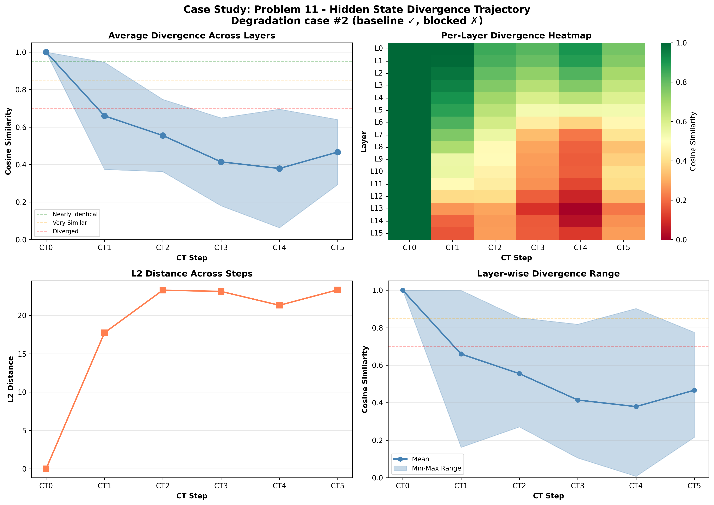

# Case Study: Problem 11

**Selection Reason**: Degradation case #2 (baseline ✓, blocked ✗)

**Impact Type**: degradation (Baseline: ✓, CT0-blocked: ✗)

---

## Problem

**Question** (truncated):
```
N/A...
```

**Gold Answer**: N/A
**Baseline Prediction**: 694
**CT0-Blocked Prediction**: 894

---

## Divergence Profile

**Overall Metrics**:
- Total divergence: 0.505
- CT1 similarity: 0.660 (34.0% diverged)
- CT4 similarity: 0.379 (62.1% diverged)
- Divergence slope: -0.039 per step
- Pattern: late_divergence

---

## Step-by-Step Divergence Analysis

### CT0 - Step 0

**Similarity**: 1.000 (0.0% diverged)
**L2 Distance**: 0.00
**Interpretation**: **Nearly identical** - no significant divergence

**Layer Analysis**:
- Most diverged layer: Layer 0 (similarity: 1.000)
- Least diverged layer: Layer 0 (similarity: 1.000)
- Layer variance: 0.000

**Note**: CT0 is identical in both conditions (as expected - same generation process)

### CT1 - Step 1

**Similarity**: 0.660 (34.0% diverged)
**L2 Distance**: 17.72
**Interpretation**: **Significantly diverged** - major differences

**Layer Analysis**:
- Most diverged layer: Layer 15 (similarity: 0.162)
- Least diverged layer: Layer 0 (similarity: 0.999)
- Layer variance: 0.286

**⚠️ IMMEDIATE DIVERGENCE**: CT1 shows significant divergence from the first step!

### CT2 - Step 2

**Similarity**: 0.555 (44.5% diverged)
**L2 Distance**: 23.29
**Interpretation**: **Significantly diverged** - major differences

**Layer Analysis**:
- Most diverged layer: Layer 14 (similarity: 0.271)
- Least diverged layer: Layer 0 (similarity: 0.853)
- Layer variance: 0.193

**📉 CASCADING**: Divergence is accumulating from previous steps.

### CT3 - Step 3

**Similarity**: 0.414 (58.6% diverged)
**L2 Distance**: 23.12
**Interpretation**: **Heavily diverged** - reasoning has fundamentally changed

**Layer Analysis**:
- Most diverged layer: Layer 13 (similarity: 0.105)
- Least diverged layer: Layer 0 (similarity: 0.819)
- Layer variance: 0.234

**📉 CASCADING**: Divergence is accumulating from previous steps.

### CT4 - Step 4

**Similarity**: 0.379 (62.1% diverged)
**L2 Distance**: 21.31
**Interpretation**: **Heavily diverged** - reasoning has fundamentally changed

**Layer Analysis**:
- Most diverged layer: Layer 13 (similarity: 0.007)
- Least diverged layer: Layer 0 (similarity: 0.903)
- Layer variance: 0.316

### CT5 - Step 5

**Similarity**: 0.467 (53.3% diverged)
**L2 Distance**: 23.33
**Interpretation**: **Heavily diverged** - reasoning has fundamentally changed

**Layer Analysis**:
- Most diverged layer: Layer 13 (similarity: 0.216)
- Least diverged layer: Layer 0 (similarity: 0.776)
- Layer variance: 0.173

---

## Interpretation

**Late Divergence Pattern**: CT1 remains relatively stable, but later steps (CT3-CT4) show significant
divergence. This suggests the model can partially compensate initially, but the lack of CT0 information
causes problems as reasoning progresses.

**Impact on Answer**: Blocking CT0 caused the model to produce an **incorrect answer**
(baseline: 694, blocked: 894, gold: N/A).
The hidden state divergence directly translated to reasoning failure.

---

## Key Takeaways

- **Layer heterogeneity**: Different layers show varied divergence (std: 0.316), suggesting specialized roles
- **Late layers most affected**: Layer 13 shows maximum divergence, possibly related to output preparation

## Visualization


