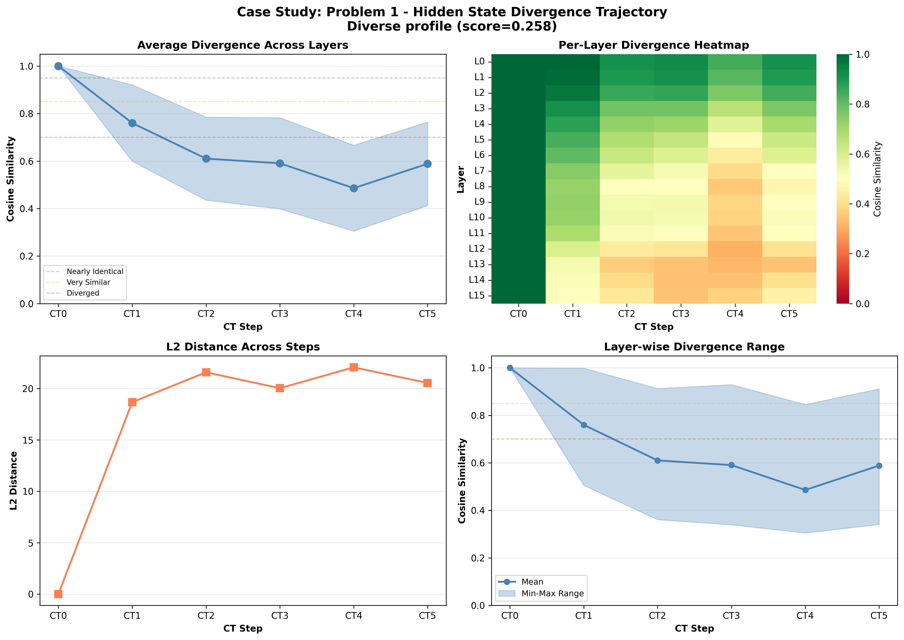

# Case Study: Problem 1

**Selection Reason**: Diverse profile (score=0.258)

**Impact Type**: no_change (Baseline: ✓, CT0-blocked: ✓)

---

## Problem

**Question** (truncated):
```
N/A...
```

**Gold Answer**: N/A
**Baseline Prediction**: 3
**CT0-Blocked Prediction**: 3

---

## Divergence Profile

**Overall Metrics**:
- Total divergence: 0.393
- CT1 similarity: 0.760 (24.0% diverged)
- CT4 similarity: 0.486 (51.4% diverged)
- Divergence slope: -0.034 per step
- Pattern: stable

---

## Step-by-Step Divergence Analysis

### CT0 - Step 0

**Similarity**: 1.000 (0.0% diverged)
**L2 Distance**: 0.00
**Interpretation**: **Nearly identical** - no significant divergence

**Layer Analysis**:
- Most diverged layer: Layer 0 (similarity: 1.000)
- Least diverged layer: Layer 0 (similarity: 1.000)
- Layer variance: 0.000

**Note**: CT0 is identical in both conditions (as expected - same generation process)

### CT1 - Step 1

**Similarity**: 0.760 (24.0% diverged)
**L2 Distance**: 18.67
**Interpretation**: **Moderately diverged** - noticeable differences

**Layer Analysis**:
- Most diverged layer: Layer 15 (similarity: 0.505)
- Least diverged layer: Layer 0 (similarity: 0.999)
- Layer variance: 0.161

**Stable start**: CT1 remains relatively similar despite CT0 blocking.

### CT2 - Step 2

**Similarity**: 0.610 (39.0% diverged)
**L2 Distance**: 21.58
**Interpretation**: **Significantly diverged** - major differences

**Layer Analysis**:
- Most diverged layer: Layer 13 (similarity: 0.361)
- Least diverged layer: Layer 0 (similarity: 0.913)
- Layer variance: 0.175

**📉 CASCADING**: Divergence is accumulating from previous steps.

### CT3 - Step 3

**Similarity**: 0.591 (40.9% diverged)
**L2 Distance**: 20.03
**Interpretation**: **Significantly diverged** - major differences

**Layer Analysis**:
- Most diverged layer: Layer 14 (similarity: 0.339)
- Least diverged layer: Layer 0 (similarity: 0.929)
- Layer variance: 0.192

### CT4 - Step 4

**Similarity**: 0.486 (51.4% diverged)
**L2 Distance**: 22.06
**Interpretation**: **Heavily diverged** - reasoning has fundamentally changed

**Layer Analysis**:
- Most diverged layer: Layer 12 (similarity: 0.305)
- Least diverged layer: Layer 0 (similarity: 0.846)
- Layer variance: 0.181

**📉 CASCADING**: Divergence is accumulating from previous steps.

### CT5 - Step 5

**Similarity**: 0.589 (41.1% diverged)
**L2 Distance**: 20.54
**Interpretation**: **Significantly diverged** - major differences

**Layer Analysis**:
- Most diverged layer: Layer 13 (similarity: 0.341)
- Least diverged layer: Layer 0 (similarity: 0.912)
- Layer variance: 0.176

---

## Interpretation

**Stable Pattern**: Despite CT0 blocking, the hidden states remain relatively stable. This may indicate
the model has alternative pathways to access needed information, or this particular problem is less
dependent on CT0's encoded information.

**Robustness**: Despite significant hidden state divergence, the model **still produced the correct answer**
in both conditions (answer: 3). This suggests redundancy in the reasoning process
or that the specific diverged representations didn't affect the critical computation for this problem.

---

## Key Takeaways

- **Layer heterogeneity**: Different layers show varied divergence (std: 0.181), suggesting specialized roles

## Visualization


