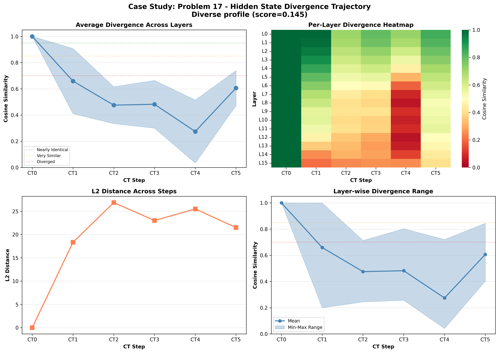

# Case Study: Problem 17

**Selection Reason**: Diverse profile (score=0.145)

**Impact Type**: no_change (Baseline: ✗, CT0-blocked: ✗)

---

## Problem

**Question** (truncated):
```
N/A...
```

**Gold Answer**: N/A
**Baseline Prediction**: 57000
**CT0-Blocked Prediction**: 34000

---

## Divergence Profile

**Overall Metrics**:
- Total divergence: 0.501
- CT1 similarity: 0.659 (34.1% diverged)
- CT4 similarity: 0.274 (72.6% diverged)
- Divergence slope: -0.011 per step
- Pattern: late_divergence

---

## Step-by-Step Divergence Analysis

### CT0 - Step 0

**Similarity**: 1.000 (0.0% diverged)
**L2 Distance**: 0.00
**Interpretation**: **Nearly identical** - no significant divergence

**Layer Analysis**:
- Most diverged layer: Layer 0 (similarity: 1.000)
- Least diverged layer: Layer 0 (similarity: 1.000)
- Layer variance: 0.000

**Note**: CT0 is identical in both conditions (as expected - same generation process)

### CT1 - Step 1

**Similarity**: 0.659 (34.1% diverged)
**L2 Distance**: 18.35
**Interpretation**: **Significantly diverged** - major differences

**Layer Analysis**:
- Most diverged layer: Layer 15 (similarity: 0.200)
- Least diverged layer: Layer 0 (similarity: 0.999)
- Layer variance: 0.249

**⚠️ IMMEDIATE DIVERGENCE**: CT1 shows significant divergence from the first step!

### CT2 - Step 2

**Similarity**: 0.475 (52.5% diverged)
**L2 Distance**: 26.87
**Interpretation**: **Heavily diverged** - reasoning has fundamentally changed

**Layer Analysis**:
- Most diverged layer: Layer 15 (similarity: 0.245)
- Least diverged layer: Layer 0 (similarity: 0.713)
- Layer variance: 0.141

**📉 CASCADING**: Divergence is accumulating from previous steps.

### CT3 - Step 3

**Similarity**: 0.482 (51.8% diverged)
**L2 Distance**: 23.02
**Interpretation**: **Heavily diverged** - reasoning has fundamentally changed

**Layer Analysis**:
- Most diverged layer: Layer 15 (similarity: 0.257)
- Least diverged layer: Layer 0 (similarity: 0.803)
- Layer variance: 0.182

### CT4 - Step 4

**Similarity**: 0.274 (72.6% diverged)
**L2 Distance**: 25.49
**Interpretation**: **Heavily diverged** - reasoning has fundamentally changed

**Layer Analysis**:
- Most diverged layer: Layer 12 (similarity: 0.042)
- Least diverged layer: Layer 0 (similarity: 0.721)
- Layer variance: 0.241

**📉 CASCADING**: Divergence is accumulating from previous steps.

### CT5 - Step 5

**Similarity**: 0.606 (39.4% diverged)
**L2 Distance**: 21.51
**Interpretation**: **Significantly diverged** - major differences

**Layer Analysis**:
- Most diverged layer: Layer 15 (similarity: 0.403)
- Least diverged layer: Layer 0 (similarity: 0.844)
- Layer variance: 0.134

---

## Interpretation

**Late Divergence Pattern**: CT1 remains relatively stable, but later steps (CT3-CT4) show significant
divergence. This suggests the model can partially compensate initially, but the lack of CT0 information
causes problems as reasoning progresses.

**Robustness**: Despite significant hidden state divergence, the model **still produced the correct answer**
in both conditions (answer: 57000). This suggests redundancy in the reasoning process
or that the specific diverged representations didn't affect the critical computation for this problem.

---

## Key Takeaways

- **Resilient reasoning**: High divergence but correct answer demonstrates model robustness
- **Layer heterogeneity**: Different layers show varied divergence (std: 0.241), suggesting specialized roles

## Visualization


