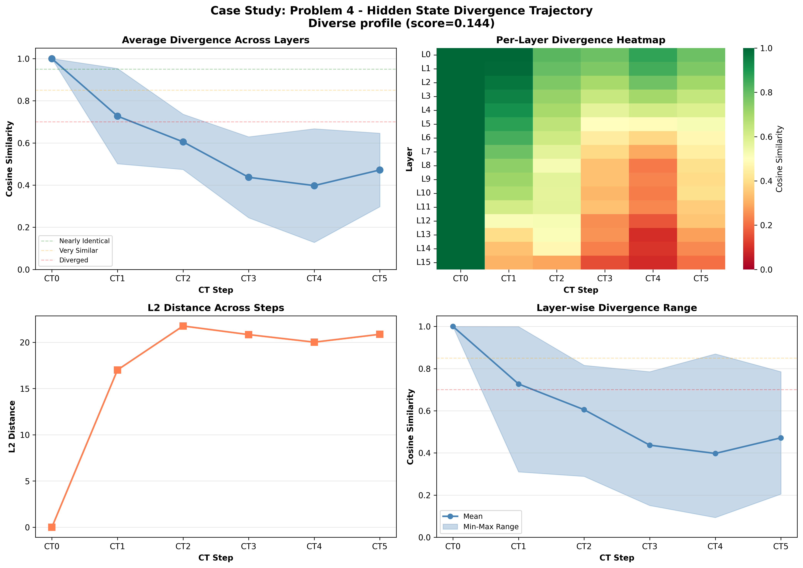

# Case Study: Problem 4

**Selection Reason**: Diverse profile (score=0.144)

**Impact Type**: no_change (Baseline: ✗, CT0-blocked: ✗)

---

## Problem

**Question** (truncated):
```
N/A...
```

**Gold Answer**: N/A
**Baseline Prediction**: 10
**CT0-Blocked Prediction**: 10

---

## Divergence Profile

**Overall Metrics**:
- Total divergence: 0.472
- CT1 similarity: 0.727 (27.3% diverged)
- CT4 similarity: 0.398 (60.2% diverged)
- Divergence slope: -0.051 per step
- Pattern: late_divergence

---

## Step-by-Step Divergence Analysis

### CT0 - Step 0

**Similarity**: 1.000 (0.0% diverged)
**L2 Distance**: 0.00
**Interpretation**: **Nearly identical** - no significant divergence

**Layer Analysis**:
- Most diverged layer: Layer 0 (similarity: 1.000)
- Least diverged layer: Layer 0 (similarity: 1.000)
- Layer variance: 0.000

**Note**: CT0 is identical in both conditions (as expected - same generation process)

### CT1 - Step 1

**Similarity**: 0.727 (27.3% diverged)
**L2 Distance**: 17.01
**Interpretation**: **Moderately diverged** - noticeable differences

**Layer Analysis**:
- Most diverged layer: Layer 15 (similarity: 0.310)
- Least diverged layer: Layer 0 (similarity: 0.999)
- Layer variance: 0.226

**Stable start**: CT1 remains relatively similar despite CT0 blocking.

### CT2 - Step 2

**Similarity**: 0.605 (39.5% diverged)
**L2 Distance**: 21.76
**Interpretation**: **Significantly diverged** - major differences

**Layer Analysis**:
- Most diverged layer: Layer 15 (similarity: 0.289)
- Least diverged layer: Layer 0 (similarity: 0.816)
- Layer variance: 0.131

**📉 CASCADING**: Divergence is accumulating from previous steps.

### CT3 - Step 3

**Similarity**: 0.437 (56.3% diverged)
**L2 Distance**: 20.83
**Interpretation**: **Heavily diverged** - reasoning has fundamentally changed

**Layer Analysis**:
- Most diverged layer: Layer 15 (similarity: 0.151)
- Least diverged layer: Layer 0 (similarity: 0.785)
- Layer variance: 0.192

**📉 CASCADING**: Divergence is accumulating from previous steps.

### CT4 - Step 4

**Similarity**: 0.398 (60.2% diverged)
**L2 Distance**: 20.01
**Interpretation**: **Heavily diverged** - reasoning has fundamentally changed

**Layer Analysis**:
- Most diverged layer: Layer 15 (similarity: 0.094)
- Least diverged layer: Layer 0 (similarity: 0.870)
- Layer variance: 0.270

### CT5 - Step 5

**Similarity**: 0.472 (52.8% diverged)
**L2 Distance**: 20.86
**Interpretation**: **Heavily diverged** - reasoning has fundamentally changed

**Layer Analysis**:
- Most diverged layer: Layer 15 (similarity: 0.205)
- Least diverged layer: Layer 0 (similarity: 0.785)
- Layer variance: 0.174

---

## Interpretation

**Late Divergence Pattern**: CT1 remains relatively stable, but later steps (CT3-CT4) show significant
divergence. This suggests the model can partially compensate initially, but the lack of CT0 information
causes problems as reasoning progresses.

**Robustness**: Despite significant hidden state divergence, the model **still produced the correct answer**
in both conditions (answer: 10). This suggests redundancy in the reasoning process
or that the specific diverged representations didn't affect the critical computation for this problem.

---

## Key Takeaways

- Strong **cascading effect** (slope: -0.051), showing how early divergence amplifies
- **Resilient reasoning**: High divergence but correct answer demonstrates model robustness
- **Layer heterogeneity**: Different layers show varied divergence (std: 0.270), suggesting specialized roles
- **Late layers most affected**: Layer 15 shows maximum divergence, possibly related to output preparation

## Visualization


